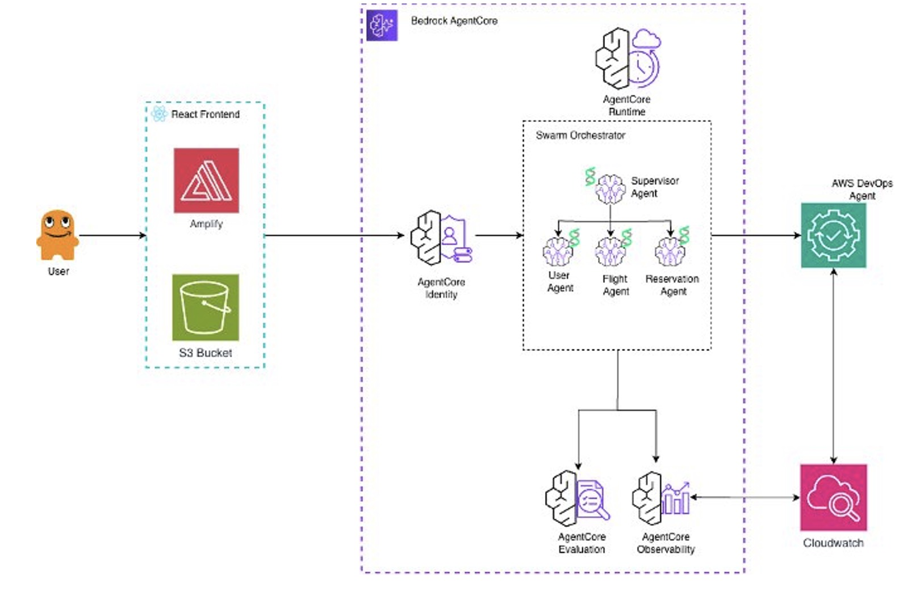

# Fullstack AgentCore Solution Template (FAST) - Sample Applications

This repository contains sample applications built using the [Fullstack AgentCore Solution Template (FAST)](https://github.com/awslabs/fullstack-solution-template-for-agentcore) as a starting point. Each sample demonstrates how to customize FAST for different use cases while leveraging AWS AgentCore.

> **⚠️ Important:** These samples are **not production-ready**. They pass automated security scanning at the time of contribution but are not guaranteed to receive ongoing security patches or dependency updates. You must thoroughly review any sample code before deploying to production. See [SECURITY.md](SECURITY.md) for details.

## Purpose

While [FAST](https://github.com/awslabs/fullstack-solution-template-for-agentcore) provides a fully functional out-of-the-box chat application, it's designed to be customized for any use case that leverages AgentCore. These samples serve as:

- **Starting points** for similar projects
- **A diverse set of examples** of how others have extended FAST for a variety of use cases
- **Learning resources** for engineers

## Available Samples

| Sample | Description |
|--------|-------------|
| [Restaurant Assistant](#restaurant-assistant) | Knowledge base integration, reservation management, and customer-facing chat widget |
| [CopilotKit Generative UI](#copilotkit-generative-ui) | Generative UI, shared state, and human-in-the-loop interactions via CopilotKit |
| [LLM Council](#llm-council) | An implementation of "Council of LLMs" pattern on AWS. Builds consensus among multiple diverse LLMs.|
| [Dual Monitoring System](#dual-monitoring-system) | Dual-layer monitoring for agentic solutions using AgentCore Evaluations and AWS DevOps Agent |

<!-- Add new samples to the table above as they are added -->

### Restaurant Assistant
**Description**: A restaurant assistant application with knowledge base integration, reservation management, and a professional customer-facing interface.

**Built on FAST**: v0.4.1

**Key Differences from FAST**: Adds an s3-vector backed knowledge base, DynamoDB reservations table, custom reservation tools, restaurant-themed landing page with chat widget, and file upload capabilities

**Use Case**: Building customer service assistants for hospitality businesses or any domain requiring knowledge base integration with transactional capabilities

### CopilotKit Generative UI
**Description**: Adds CopilotKit as the frontend framework on top of FAST, enabling generative UI (inline charts and components rendered from tool calls), bidirectional shared state between the agent and UI, and human-in-the-loop interactions.

**Built on FAST**: v0.4.1

**Key Differences from FAST**: Replaces the baseline frontend with CopilotKit, adds a CopilotKit Runtime Lambda as a server-side bridge to AgentCore, and includes both LangGraph and Strands agent patterns with CopilotKit middleware.

**Use Case**: Building agent-native applications where the AI drives the UI — not just chat — including dashboards, collaborative canvases, and interactive workflows.

### [LLM Council](samples/llm-council/)

**Description**: An implementation of "Council of LLMs" pattern on AWS. Multiple diverse LLMs collaborate through a 3-stage deliberation process -- independent responses, anonymized peer ranking, and chairman synthesis -- to produce higher-quality answers than any single model alone.

**Key Differences from FAST**: Replaces single-agent pattern with multi-model council orchestration, parallel Bedrock Converse API invocations across 4 providers (Anthropic, Meta, Amazon, Cohere), anonymized peer ranking with aggregate scoring, chairman synthesis stage, custom streaming event format with stage-by-stage SSE updates, council-specific React UI with tabbed model responses and ranking matrix

**Use Case**: Building applications where response quality matters more than latency, reducing single-model bias, combining strengths of diverse model providers, or any use case benefiting from collaborative AI deliberation

### [Dual Monitoring System](samples/dual-monitoring-system/)

**Description**: A dual-layer monitoring architecture for agentic solutions in dev/prod env. Layer 1 uses AgentCore Evaluations to continuously score live agent interactions with LLM-as-a-Judge methodology, surfacing quality degradation that infrastructure metrics miss. Layer 2 uses AWS DevOps Agent to autonomously investigate infrastructure incidents — pulling CloudWatch logs, building resource topology graphs, and tracing complete failure paths with remediation steps.

**Built on FAST**: v0.4.1

**Key Differences from FAST**: Adds an evaluation dashboard (session explorer, on-demand evaluation, AI pattern analysis, prompt improvement, online evaluation config), a DevOps Agent incident submission interface with SigV4-signed webhook proxy, a four-agent Strands swarm as the demo workload (supervisor, flight, user, and reservation agents), and additional CDK stacks for evaluation and DevOps Agent infrastructure.

**Use Case**: Monitoring multi-agent systems in production where traditional infrastructure metrics are insufficient — particularly swarm-based architectures with dynamic handoffs where quality degradation and failure propagation are hard to detect.

<!-- Template for new samples:
### [Sample Name](samples/sample-directory-name/)
**Description**: Brief description of what this sample demonstrates
**Built on FAST**: version
**Key Differences from FAST**: What makes this sample unique
**Use Case**: When you might want to use this pattern
-->

## Contributing

Have you built something with FAST? We'd love to see it! Please see [CONTRIBUTING.md](CONTRIBUTING.md) for guidelines on how to contribute your sample application.

## Support

For questions about:
- **FAST itself**: See the main [FAST repository](https://github.com/awslabs/fullstack-solution-template-for-agentcore)
- **Specific samples**: Open an issue in this repository
- **Contributing samples**: See [CONTRIBUTING.md](CONTRIBUTING.md)

## License

This project is licensed under the Apache-2.0 License.

